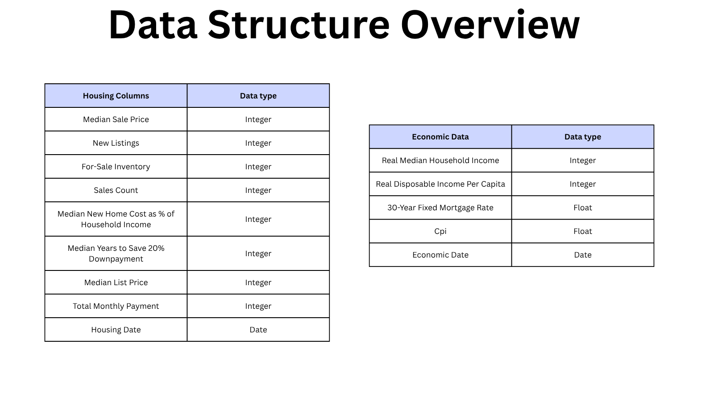

# Housing-Market-Visualization

I developed a Power BI housing market dashboard analyzing U.S. housing trends and affordability. The project involved data preprocessing, cleaning, data modeling, visualization, and insight generation to evaluate how economic conditions have influenced the housing market over time.
# Background Overview:

The U.S. housing market is a significant indicator of overall economic health and plays an important role in household wealth and financial stability. In recent years, housing affordability has become an increasingly important issue for many Americans, particularly younger generations seeking homeownership. Rising home prices, changing mortgage rates, inflation, and shifts in household income have all contributed to evolving housing market conditions across the country. This project analyzes housing market trends from 2014 to 2026 using Zillow housing data and economic indicators from FRED. By examining metrics such as home prices, sales activity, affordability, mortgage rates, unemployment, and income levels, the dashboard aims to provide insight into how economic conditions have influenced the housing market over time and what economic levers may be most important for making homeownership more attainable in the future.

# Data Structure Overview

This project combines housing market data from Zillow with broader economic indicators from FRED to analyze affordability, pricing trends, and market conditions.

[Federal Reserve Economic Data (FRED)](https://fred.stlouisfed.org/)

[Zillow Housing Data](https://www.zillow.com/research/data/)

## Zillow Data

- **Median Years to Save a 20% Down Payment:** Estimated number of years for the median household to save enough for a 20% down payment, assuming 10% of income is saved annually.

- **Total Monthly Payment:** Estimated monthly cost of owning a typical home, including the mortgage payment, property taxes, homeowners insurance, and maintenance.

- **New Homeowner Affordability:** Percentage of the median household's income required to cover the monthly cost of purchasing and owning a typical home. Values above 30% are generally considered unaffordable.

*Note: Zillow provides regional housing data; this analysis uses nationwide U.S. data.*

## FRED Data

- **Real Median Household Income:** Median household income adjusted for inflation.

- **Real Disposable Income Per Capita:** Average after-tax income per person, adjusted for inflation.

- **Consumer Price Index (CPI):** Measures changes in the average prices consumers pay for goods and services and is the primary measure of inflation.

# Executive Summary

The first half of the decade featured a strong housing market for buyers, supported by low mortgage rates and a strong economy. Since 2020, however, the market has shifted dramatically. Median home prices have surged 38% while real disposable income grew just 5% over the same period, severely eroding affordability. Mortgage rates rose sharply from historic lows of 2.68% in 2021 to a peak of 7.62% in 2023, before settling in the 6.5–7% range. This combination of rapid price appreciation, higher borrowing costs, and slowing economic conditions triggered a steep decline in home sales after their 2021 peak, creating a far more challenging environment for prospective buyers.

# Key Insights

- **Homeownership has become significantly less attainable** since 2020 due to home prices and the cost of living outpacing income growth by a significant margin.
- **Monthly mortgage payments have increased substantially** due to both higher home prices and elevated interest rates, creating additional affordability pressure for buyers. 
- **Housing demand has weakened as affordability challenges increased**, reflected by declining sales activity despite prices remaining elevated. 
- **Mortgage rates remain a critical lever affecting sales activity** due to their direct impact on borrowing costs and monthly payments.
- **Future affordability improvements will likely require stabilization in both home prices and borrowing costs.**
